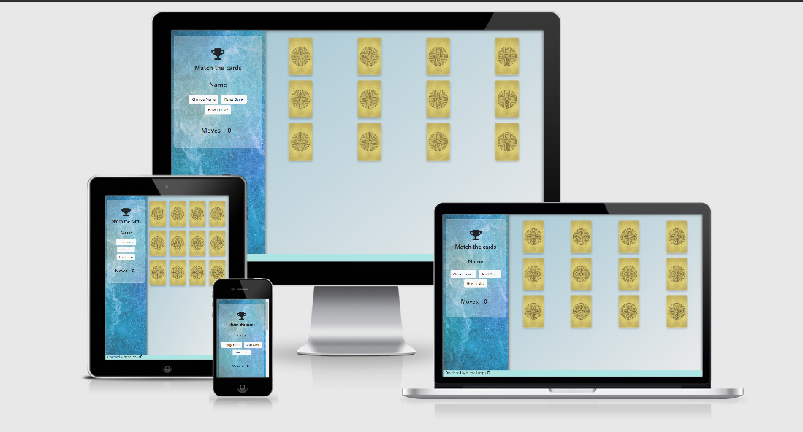

# [Fun cards memory game](https://nicolalampis.github.io/card_memory_game_JS/)

____
## Milestone Project for Interactive Frontend Development - Code Institute
 
This web game application is both an entertaining way to pass the time and a tool to sharpen your memory skills.
____
# Table of contents
 
1. [**Strategy**](#strategy)   
    - [**Project goals**](#project-goals)   
    - [**Player goals**](#player-goals)   
    - [**User Stories**](#user-stories)   
2. [**Scope**](#scope)   
3. [**Structure**](#structure)   
4. [**Skeleton**](#skeleton)   
    - [**Wireframe**](#wireframe)   
5. [**Surface**](#surface)   
6. [**Features**](#features)   
7. [**Technologies used**](#technologies-used)   
8. [**References for learning**](#references-for-learning)   
9. [**Testing**](#testing)   
10. [**Code validity**](#code-validity)   
11. [**Version control**](#version-control)   
12. [**Deployment**](#deployment)   
13. [**Credits**](#credits)   
    - [**Content**](#content)   
    - [**Media**](#media)   
    - [**Code**](#code)   
14. [**Acknowledgments**](#acknowledgments)   
 
# UX
One page web application for a single player memory card game.
 
## Strategy
### Project goals
- A game with a simple look, easy to play, with intuitive instruction.
- App fully responsive on desktops, tablets and mobiles.
- Colorful images to make the game interestig for everyone.
- Enjoyable interaction developed in Javascript.
### User goals
- An entertaining game to play.
- A game that help to improve the memory, challenging enough but not too tough.
- A good looking interface, easy to read.
### User stories
- A user new to this kind of memory game wants to read clear instruction.
- A user wants to play the game without distraction or a messy screen.
- A user wants the game to be responsive and functional on any device.
- A user wants to have a positive interaction with every element of the page.
- A user need a win/lose popup message to be engaged, as well as a counter of moves.
- A user wants a reset button.
- A user wants to display his/her name.
## Scope
- This project will be part of my portfolio, showing my skills on interactive frontend development.
- The goal of this web application is to create a game with a smooth user interaction, and of course a fun game to play.
- Popup, buttons and modal messages make part of the interaction, and the game itself is a fine tuned tool that react to the user actions.
## Structure
- This is a simple single page design with two main section. 
- Responsive design, to be visualized in all screens.
- Users can quickly access all the informations, and function of the game, so the level of attention remains constant.
- Informations provided are enough and not overwhelming, some of them show up when needed to guide or alert the user.
- Animations react to actions like the user expect, and are tailored to be responsive and natural.
## Skeleton
- One page fullscreen.
- A section for main controls, like title, buttons and informations.
- A section for the card game, with a responsive matrix 4x3 that on mobiles changes to 3x4
- The footer is minimal and provide my github contact and my name.
### Wireframe
[First concept of the site](assets/mockup.png)
## Surface
- The visual experience is relaxing for the eyes, main colors are pale blue and light grey.
- Cards stand out with a yellow color and a round element at the center (Chartres cathedral labyrinth).
- The back face of the cards are colorful and vivid. Images of fruits stimulate the memory with different shapes and colors.
- When you lose the popup message is red, whereas is green when you win.
- Typography is simple and consistent.
____
## Features
- Set a name, click the 'Change name' button and write a name of maximum 14 digits into the modal window. The name will be displayed in the control panel.
- The Restart button set a new game, flip back and shuffle the cards.
- A counter displays the number of moves. To win you must complete the game in 14 moves.
- Popup messages show up when you win/lose.
- When the game end, the counter stop and the cards change their behaviour.
#### Features left to implement
- Avatar images
- Difficulty levels 
## Technologies used
- HTML   
- CSS   
- Javascript   
- jQuery  
- Bootstrap     
- GitPod   
- GitHub    
- Photoshop 
## References for learning
Bootstrap documentation   
https://www.w3schools.com/    
https://stackoverflow.com/   
https://www.freecodecamp.org/   
https://github.com/   
https://fontawesome.com/      
## Testing
- Tested the responsive behaviour of images and text on desktops, laptops, and mobiles.
- Different bugs show up during the development of the javascript code, the first was the check for a match between two card. I ended up defining a first and second card variables.
- "Stop flipping card" was a function that needed a timeout in order to see the rotation of the second card (give enough time to memorize the card that didn’t match) before it flips back.
- If you click fast enough you can rotate three cards at the time and have an incorrect behaviour. The bug is fixed by simplifying the Match-function and adding a remove-event-listener
- Button "Reset" clear the number of moves, flips back and shuffle the cards.
- Button "Change name" opens a modal window with a form, a save button and a close button. The save button dysplay correctly the Name in the dashboard.
- Button "How to play" opens a modal window with the instructions on how to play.
- Win/Lose popups are centered in the viewport and show a lovely animation right after the Win/Lose event.
- After you Lose, you are not longer able to flip the cards, so you can play again by clicking the "Reset" button.
- Tested the external link, it opened in a new tab and went to the correct page.
## Code validity
[JSHint - Javascript validator](https://jshint.com/) 

[CSS Validation Service](https://jigsaw.w3.org/css-validator/) 
This document validates as CSS level 3 + SVG 

[Markup Validation Service](https://validator.w3.org/)
Document checking completed. No errors or warnings to show.

[Vendor Prefixes](https://autoprefixer.github.io/)
Autoprefixer parses the CSS and adds vendor prefixes
## Version control
The history of every file in this repository is stored in Git and can be restored.   
Logs shows the date, author and messages committed.   
The 'Reset' command will restore the version selected.     
## Deployment
This project was developed using the GitPod IDE, committed to git and pushed to GitHub.   
- To deploy this page to GitHub Pages, first I wnet to the GitHub repository.   
- Under the 'Settings section', scrolled down to GitHub 'Pages' section.   
- Under the 'Source' drop-down, the 'Master branch' was selected. The page was automatically refreshed and the website deployed.   
- The code can be run locally through clone or download.   
- Open the repository, click on the green 'Code' button and select either 'clone or download'.   
- The Clone option provides a url, which you can use on your desktop IDE.   
- The Download ZIP option download a ZIP file you can use on your local machine.   

[You can run the site here](https://nicolalampis.github.io/card_memory_game_JS/) 
## Credits
- All text content is written by Nicola Lampis.   
- I made some minor changes in all the photos. All the photo came from [Unsplash](https://unsplash.com/).
- Background image in the dashboard by Max Saeling.   
- Cherry by T.Q.
- Ananas by Miguel Andrade
- Apple by IamCristian
- Banana and Orange by Mockup Graphics
- Strawberry by Allec Gomes
- The front card image is made by me using the representation of the Chartres cathedral labyrinth.
- Marina Ferreira memory game tutorial. [Freecodecamp.org](https://www.freecodecamp.org/news/vanilla-javascript-tutorial-build-a-memory-game-in-30-minutes-e542c4447eae/) and [YouTube](https://www.youtube.com/watch?v=ZniVgo8U7ek&t=211s)  
- Tutorial flip card [w3schools.com](https://www.w3schools.com/howto/howto_css_flip_card.asp)     
- SHUFFLE function is based on the Fisher-Yates modern shuffle algorithm.
## Acknowledgments
My mentor Medale Oluwafemi guided me towards the creation the site, and the interactive aspects of it.  
I received inspiration for this project from his experience and from previous projects done by students of Code Institute.